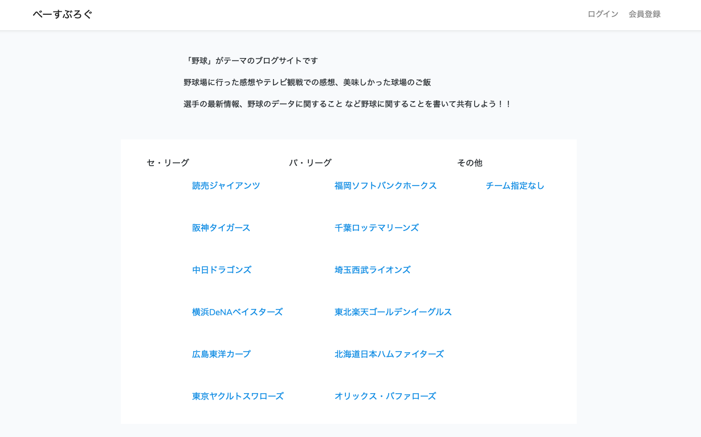

<a href="https://baseblog.herokuapp.com"><h1 align="center">baseblog（ベーすぶろぐ）</h1></a>

<h3>・アプリの概要</h3>

&ensp; 野球がテーマのブログ投稿サイトです。

&ensp; プロ野球ファンが情報を収集したり、意見を呟いたり、交流したりする場所が欲しかったため作成しました。

<h3>・使用言語・OSなど</h3>

&ensp; [言語] &ensp; PHP

&ensp; [OS] &ensp; Amazon linux

&ensp; [FW] &ensp; Laravel 6

&ensp; [DB] &ensp; MariaDB

<h3>・機能一覧</h3>

&ensp; ・ユーザー登録、ログイン機能

&ensp; ・記事投稿・編集・削除機能

<h3>・工夫した点</h3>

&ensp; ・リレーションを多く使用

&ensp; ・記事一覧画面の表示

<h3>・テストアカウント</h3>

&ensp; ID : yakyu@example.com

&ensp; pass : baseball
 
